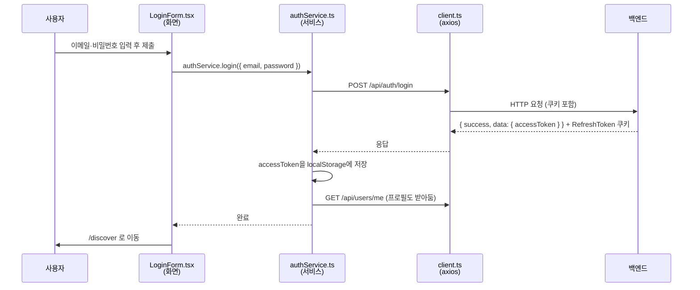
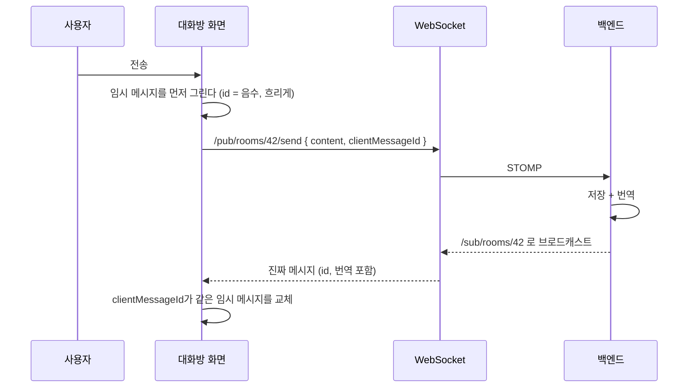

# DariChat 프론트엔드 안내서

> 백엔드는 아는데 프론트는 처음인 사람을 위한 문서입니다.
> 1부에서 개념을 짧게 깔고, 2부에서 **우리 프로젝트 실제 코드**를 따라갑니다.
> 모든 경로는 `fe/` 기준입니다.

---

## 목차

- [0. 시작하기 전에](#0-시작하기-전에)
- [1부. 기초 개념](#1부-기초-개념)
  - [1.1 브라우저는 무엇을 하나](#11-브라우저는-무엇을-하나)
  - [1.2 React — 화면을 함수로 만든다](#12-react--화면을-함수로-만든다)
  - [1.3 state와 리렌더링](#13-state와-리렌더링)
  - [1.4 useEffect — 화면 밖 세상과 연결하기](#14-useeffect--화면-밖-세상과-연결하기)
  - [1.5 Next.js와 App Router](#15-nextjs와-app-router)
  - [1.6 TypeScript](#16-typescript)
  - [1.7 Tailwind CSS](#17-tailwind-css)
  - [1.8 zustand — 화면 밖에 두는 상태](#18-zustand--화면-밖에-두는-상태)
- [2부. DariChat 코드 투어](#2부-darichat-코드-투어)
  - [2.1 폴더 구조](#21-폴더-구조)
  - [2.2 로그인 — 요청 한 번을 끝까지 따라가기](#22-로그인--요청-한-번을-끝까지-따라가기)
  - [2.3 apiClient — 프론트의 필터 체인](#23-apiclient--프론트의-필터-체인)
  - [2.4 로그인 가드와 레이아웃](#24-로그인-가드와-레이아웃)
  - [2.5 방 목록 — 여러 화면이 공유하는 상태](#25-방-목록--여러-화면이-공유하는-상태)
  - [2.6 채팅 — WebSocket과 낙관적 업데이트](#26-채팅--websocket과-낙관적-업데이트)
  - [2.7 번역 표시](#27-번역-표시)
  - [2.8 이메일 인증 화면](#28-이메일-인증-화면)
  - [2.9 mock 모드 — 백엔드 없이 개발하기](#29-mock-모드--백엔드-없이-개발하기)
  - [2.10 테스트](#210-테스트)
- [3부. 직접 해보기](#3부-직접-해보기)
- [4부. 자주 막히는 곳](#4부-자주-막히는-곳)

---

## 0. 시작하기 전에

### 실행

```bash
cd fe
npm install
cp .env.example .env.local   # 이미 있으면 생략
npm run dev                  # http://localhost:3000
```

`.env.local`의 `NEXT_PUBLIC_USE_MOCK=true`로 두면 **백엔드 없이** 가짜 데이터로 화면이 전부 돕니다. 처음 구경할 때 이 모드를 권합니다. 자세한 건 [2.9](#29-mock-모드--백엔드-없이-개발하기).

```bash
npm test            # 테스트
npx tsc --noEmit    # 타입 검사 (컴파일 에러만 확인)
npm run build       # 배포용 빌드
```

### 백엔드 개념과의 대응표

먼저 큰 그림입니다. 정확히 같지는 않지만 위치를 잡는 데 도움이 됩니다.

| 백엔드 | 프론트 (DariChat) |
|---|---|
| `@RestController` | **페이지 컴포넌트** — `src/app/**/page.tsx` (URL 하나 = 파일 하나) |
| `@Service` | **service** — `src/features/*/service/*.ts` (API 호출을 모아둔 곳) |
| `RestTemplate` / `WebClient` | **axios** — `src/shared/api/client.ts` |
| `Filter` / `Interceptor` | **axios 인터셉터** — 토큰 붙이기·401 재발급 |
| DTO | **타입** — `src/shared/types/api.types.ts` |
| 세션 / 애플리케이션 스코프 빈 | **zustand store** — `src/features/*/model/*Store.ts` |
| `application.yml` | `.env.local` (`NEXT_PUBLIC_*`) |
| JUnit | **Jest** — `*.test.ts(x)` |

---

# 1부. 기초 개념

## 1.1 브라우저는 무엇을 하나

브라우저는 세 가지를 받습니다.

- **HTML** — 화면의 구조 (뼈대)
- **CSS** — 생김새 (색·크기·배치)
- **JavaScript** — 동작 (클릭하면 뭐가 일어나는지)

옛날 방식은 서버가 화면마다 완성된 HTML을 만들어 내려줬습니다(JSP, Thymeleaf처럼). 요즘 방식은 **JS가 브라우저 안에서 화면을 직접 그립니다.** 서버는 JSON만 주고, 화면 조립은 프론트가 합니다. DariChat이 이 방식이고, 그래서 백엔드는 `@RestController`로 JSON만 내려주면 됩니다.

이때 브라우저가 들고 있는 화면 구조를 **DOM**이라고 부릅니다. "화면을 바꾼다 = DOM을 고친다"입니다. 원래 JS로 DOM을 직접 고치는 건 이렇게 생겼습니다.

```js
document.getElementById('count').innerText = '3';   // 손으로 DOM 조작
```

화면이 조금만 복잡해져도 "지금 뭘 어디까지 고쳤더라"가 엉킵니다. React가 푸는 게 정확히 이 문제입니다.

## 1.2 React — 화면을 함수로 만든다

React에서 화면 조각 하나를 **컴포넌트**라고 하고, 그냥 **함수**입니다. 데이터를 받아서 화면을 반환합니다.

```tsx
function Greeting({ name }: { name: string }) {
  return <p>안녕하세요, {name}님</p>;
}

// 사용하는 쪽
<Greeting name="민수" />
```

- 함수 안의 HTML처럼 생긴 문법을 **JSX**라고 합니다. JS 안에 HTML을 쓰는 것으로, `{}` 안에는 JS 표현식을 넣습니다.
- 함수에 넘기는 값(`name`)을 **props**라고 합니다. 메서드 파라미터라고 보면 됩니다. **props는 받는 쪽에서 바꾸지 않습니다** (읽기 전용).

핵심 사고방식은 이겁니다.

> **DOM을 고치는 게 아니라, "이 데이터일 때 화면은 이렇게 생겼다"를 함수로 적는다.**
> 데이터가 바뀌면 React가 함수를 다시 실행해서 달라진 부분만 알아서 DOM에 반영한다.

우리 코드에서 가장 단순한 예 — `src/features/rooms/ui/RoomList.tsx`의 시각 표시:

```tsx
const formatLastMessageAt = (timestamp: string | null) =>
  timestamp ? formatTimeOrDate(timestamp) : '';
```

`timestamp`가 없으면 빈 문자열, 있으면 포맷된 시각. "언제 지우고 언제 다시 쓸지"를 명령하지 않고 **결과만** 적습니다.

## 1.3 state와 리렌더링

props가 밖에서 받는 값이라면, **state**는 컴포넌트가 스스로 들고 있는 값입니다. `useState`로 만듭니다.

```tsx
const [email, setEmail] = useState('');   // [현재값, 바꾸는 함수]
```

`setEmail('a@b.com')`을 호출하면 값이 바뀌고, **React가 그 컴포넌트 함수를 다시 실행**해서 화면을 새로 그립니다. 이걸 리렌더링이라고 합니다.

`src/features/auth/ui/LoginForm.tsx`를 보면 화면에 필요한 값이 전부 state입니다.

```tsx
const [email, setEmail] = useState(searchParams.get('email') ?? '');
const [password, setPassword] = useState('');
const [error, setError] = useState('');
const [isLoading, setIsLoading] = useState(false);
```

입력창은 이렇게 state와 묶습니다.

```tsx
<input value={email} onChange={(e) => setEmail(e.target.value)} />
```

값은 state에서 내려오고, 사용자가 타이핑하면 state를 바꿉니다. **화면의 진실은 항상 state 쪽에 있습니다** (DOM이 아니라). 이 패턴을 제어 컴포넌트라고 부릅니다.

로딩 상태도 마찬가지로 그냥 값입니다.

```tsx
<button disabled={isLoading}>
  {isLoading ? '로그인 중...' : '로그인'}
</button>
```

### 규칙 하나: state는 갈아끼운다, 고치지 않는다

React는 "값이 바뀌었는지"를 **참조 비교**로 판단합니다. 배열이나 객체를 제자리에서 수정하면 참조가 그대로라 React가 변화를 못 알아챕니다.

```tsx
// ✗ 안 된다 — 화면이 안 바뀐다
messages.push(newMessage);
setMessages(messages);

// ✓ 새 배열을 만든다
setMessages((prev) => [...prev, newMessage]);
```

`src/app/(protected)/chat/[roomId]/page.tsx`가 이 방식을 계속 씁니다. 하나만 바꿀 때도 `map`으로 새 배열을 만듭니다.

```tsx
setMessages((prev) =>
  prev.map((m) =>
    m.clientMessageId === clientMessageId
      ? { ...m, publishStatus: PublishStatus.FAILED }   // 바뀐 것만 새 객체
      : m                                               // 나머지는 그대로
  )
);
```

Java로 치면 엔티티를 수정하는 게 아니라 매번 새 불변 객체를 만들어 리스트를 교체하는 셈입니다.

## 1.4 useEffect — 화면 밖 세상과 연결하기

컴포넌트 함수는 "이 데이터면 화면은 이렇다"만 적는 자리라, API 호출이나 타이머 같은 **부수효과**는 여기 직접 쓰면 안 됩니다(리렌더링마다 실행돼 버립니다). 그런 건 `useEffect`에 넣습니다.

```tsx
useEffect(() => {
  fetchFriends();       // 렌더링이 끝난 뒤 실행된다
}, [fetchFriends]);     // ← 의존성 배열
```

의존성 배열의 의미:

| 배열 | 언제 실행되나 |
|---|---|
| `[]` | 컴포넌트가 처음 화면에 붙을 때 한 번 |
| `[a, b]` | 처음 + `a`나 `b`가 바뀔 때마다 |
| 생략 | 렌더링될 때마다 (거의 안 씀) |

정리(cleanup)가 필요하면 함수를 반환합니다. 이게 "컴포넌트가 화면에서 사라질 때" 실행됩니다.

```tsx
useEffect(() => {
  const timer = setTimeout(() => setCooldown((prev) => prev - 1), 1000);
  return () => clearTimeout(timer);   // ← 정리
}, [cooldown]);
```

이건 실제 우리 코드(`src/features/auth/ui/VerifyEmailForm.tsx`)의 재발송 카운트다운입니다. `cooldown`이 바뀔 때마다 effect가 다시 돌면서 1초 뒤 1을 빼는 타이머를 새로 겁니다. 이전 타이머는 cleanup으로 지웁니다.

WebSocket 구독도 같은 모양입니다 — `src/app/(protected)/useServerEvents.ts`에서 연결을 걸고, 반환 함수에서 구독 해제와 연결 종료를 합니다.

## 1.5 Next.js와 App Router

React만으로는 "주소 /rooms 로 가면 이 화면"이 없습니다. 그걸 포함해 실무에 필요한 것들을 붙인 게 **Next.js**입니다. 우리는 Next 16의 **App Router**를 씁니다.

**폴더 구조가 곧 URL입니다.**

| 파일 | URL |
|---|---|
| `src/app/page.tsx` | `/` |
| `src/app/auth/login/page.tsx` | `/auth/login` |
| `src/app/auth/verify-email/page.tsx` | `/auth/verify-email` |
| `src/app/(protected)/rooms/page.tsx` | `/rooms` |
| `src/app/(protected)/chat/[roomId]/page.tsx` | `/chat/42` |

두 가지 규칙만 알면 됩니다.

- **`(괄호)` 폴더는 URL에 안 들어갑니다.** `(protected)`는 "로그인이 필요한 화면들"을 묶으려고 만든 그룹입니다. 주소는 `/protected/rooms`가 아니라 `/rooms`입니다.
- **`[대괄호]`는 경로 변수**입니다. Spring의 `@PathVariable`과 같습니다. `[roomId]` → `/chat/42`에서 `42`.

`layout.tsx`는 그 폴더 아래 모든 페이지를 감싸는 껍데기입니다. 페이지를 옮겨 다녀도 레이아웃은 유지됩니다 — 그래서 WebSocket 연결처럼 "화면 전체가 공유해야 하는 것"을 레이아웃에 둡니다([2.4](#24-로그인-가드와-레이아웃)).

### `'use client'`가 뭔가

Next는 컴포넌트를 기본적으로 **서버에서** 실행해 HTML을 만들어 보냅니다(첫 화면이 빨라집니다). 그런데 서버에는 `useState`도 `onClick`도 `localStorage`도 없습니다. 그런 게 필요한 컴포넌트는 파일 맨 위에 이렇게 적습니다.

```tsx
'use client';
```

"이건 브라우저에서 돌려라"는 표시입니다. 우리 프로젝트는 상호작용이 많아서 대부분의 컴포넌트에 붙어 있습니다. 반대로 `src/app/auth/login/page.tsx`는 껍데기만 있어 서버 컴포넌트로 둡니다.

```tsx
import { Suspense } from 'react';
import { LoginForm } from '@/features/auth/ui/LoginForm';

export default function LoginPage() {
  return (
    <Suspense>
      <LoginForm />
    </Suspense>
  );
}
```

> `@/`는 `src/`를 가리키는 별칭입니다 (`tsconfig.json`). `../../../` 지옥을 피하려고 씁니다.

## 1.6 TypeScript

JS에 타입을 붙인 언어입니다. Java를 했다면 대부분 익숙할 겁니다.

```ts
export interface LoginRequest {
  email: string;
  password: string;
}

export interface UserResponse {
  name: string;
  profileImageUrl: string | null;   // null이 올 수 있다는 걸 타입에 적는다
  bio: string | null;
  preferredLanguage: PreferredLanguage;
}
```

`| null`이 중요합니다. "이 값은 없을 수 있다"가 타입에 적혀 있어서, 안 따지고 쓰면 컴파일이 막힙니다. Java의 `Optional`이 강제되는 느낌입니다.

**타입은 런타임에 사라집니다.** 서버가 타입과 다른 걸 보내도 TS가 막아주지 않습니다. 그래서 `src/shared/types/api.types.ts`는 백엔드 DTO를 손으로 맞춰 적은 "약속 문서"이고, 백엔드가 필드를 바꾸면 여기도 같이 고쳐야 합니다. 실제로 그 파일 주석에는 스웨거 기준이라는 것과, 필드가 언제 비는지가 적혀 있습니다.

## 1.7 Tailwind CSS

별도 CSS 파일을 만들지 않고 클래스 이름으로 스타일을 직접 붙입니다.

```tsx
<button className="w-full h-11 bg-accent text-accent-fg text-sm font-semibold rounded-xl">
```

| 클래스 | 뜻 |
|---|---|
| `w-full` | `width: 100%` |
| `h-11` | 높이 2.75rem (숫자 1 = 0.25rem) |
| `px-4` / `py-2` | 좌우 / 상하 안쪽 여백 |
| `flex` `justify-end` `gap-2` | flexbox 배치 |
| `text-sm` `font-semibold` | 글자 크기·굵기 |
| `rounded-xl` | 모서리 둥글게 |
| `md:w-[320px]` | 화면이 넓을 때(md 이상)만 적용 |

`bg-accent`, `text-ink-muted`처럼 생긴 건 Tailwind 기본값이 아니라 우리가 `tailwind.config.ts`에 정의한 **디자인 토큰**입니다. 다크 모드 대응이 여기 묶여 있어서, 색은 되도록 이 토큰을 쓰고 `bg-[#fff]` 같은 직접 값은 피합니다.

## 1.8 zustand — 화면 밖에 두는 상태

`useState`는 컴포넌트 하나의 값입니다. 그런데 방 목록처럼 **여러 화면이 같이 봐야 하는 값**이 있습니다. 이럴 때 컴포넌트 밖에 상태를 두는 도구가 zustand입니다. 싱글턴 빈 하나라고 생각하면 편합니다.

```ts
export const useRoomsStore = create<RoomsState>((set, get) => ({
  rooms: [],
  isLoading: false,

  async fetchRooms() {
    set({ isLoading: true });
    set({ rooms: await roomService.getMyRooms(), hasLoaded: true });
  },
}));
```

쓰는 쪽:

```tsx
const rooms = useRoomsStore((state) => state.rooms);        // 값 구독
const fetchRooms = useRoomsStore((state) => state.fetchRooms); // 액션 꺼내기
```

`(state) => state.rooms`처럼 **필요한 조각만 골라 구독**하는 게 포인트입니다. 그 조각이 바뀔 때만 이 컴포넌트가 다시 그려집니다.

---

# 2부. DariChat 코드 투어

## 2.1 폴더 구조

```
src/
├── app/                    ← 라우팅. URL 하나 = 폴더 하나
│   ├── auth/               ← 로그인·회원가입·이메일 인증 (비로그인)
│   └── (protected)/        ← 로그인해야 들어오는 화면들
├── features/               ← 기능 단위. 여기에 실제 알맹이가 있다
│   ├── auth/               ← 로그인·가입·이메일 인증
│   ├── chat/               ← 대화창
│   ├── rooms/              ← 방 목록
│   ├── friends/            ← 친구
│   ├── users/              ← 프로필
│   └── tutorial/           ← 첫 사용자 안내
└── shared/                 ← 여러 기능이 함께 쓰는 것
    ├── api/                ← axios 설정, WebSocket, mock 데이터
    ├── lib/                ← 토큰 저장, 시각 포맷 등 유틸
    ├── types/              ← 백엔드 DTO에 대응하는 타입
    ├── ui/                 ← 버튼·아바타·헤더 등 공용 컴포넌트
    └── config/             ← 환경변수 읽기
```

`features/*` 안은 다시 세 겹입니다. 백엔드의 controller/service/repository 나누기와 같은 발상입니다.

| 폴더 | 역할 | 예 |
|---|---|---|
| `ui/` | 화면. 보이는 것과 사용자 입력 | `LoginForm.tsx` |
| `service/` | 서버 호출. axios를 부르는 유일한 자리 | `authService.ts` |
| `model/` | 여러 화면이 공유하는 상태 | `roomsStore.ts` |

**규칙 하나만 지키면 됩니다: 화면 컴포넌트에서 `apiClient`를 직접 부르지 않습니다.** 항상 `service`를 거칩니다. 그래야 mock 모드 전환과 테스트가 한 곳에서 됩니다.

## 2.2 로그인 — 요청 한 번을 끝까지 따라가기

로그인 버튼을 누르면 무슨 일이 벌어지는지 순서대로 봅니다.



**① 화면** — `src/features/auth/ui/LoginForm.tsx`

```tsx
const handleSubmit = async (e: React.FormEvent) => {
  e.preventDefault();          // 폼 기본 동작(페이지 새로고침)을 막는다
  setError('');
  setIsLoading(true);

  try {
    await authService.login({ email, password });
    router.push('/discover');
  } catch (err) {
    // 비밀번호는 맞았는데 이메일만 미인증이면 인증 화면으로 보낸다
    if (toErrorCode(err) === AUTH_ERROR.EMAIL_NOT_VERIFIED) {
      router.push(`/auth/verify-email?email=${encodeURIComponent(email)}`);
      return;
    }
    setError(toErrorMessage(err, '로그인에 실패했습니다. 다시 시도해 주세요.'));
    setIsLoading(false);
  }
};
```

화면은 **입력을 모으고, 결과에 따라 어디로 갈지만** 정합니다. HTTP를 모릅니다.

**② 서비스** — `src/features/auth/service/authService.ts`

```ts
async login(data: LoginRequest): Promise<TokenResponse> {
  if (USE_MOCK) { /* 가짜 응답으로 끝낸다 */ }

  const response = await apiClient.post('/api/auth/login', data);
  const token = unwrap<TokenResponse>(response);
  saveTokens(token);

  // 내 메시지 판별(닉네임)과 번역문 선택(선호 언어)에 필요해 프로필을 함께 받아둔다
  const profile = await apiClient.get('/api/users/me');
  cacheCurrentUser(unwrap<UserResponse>(profile));

  return token;
}
```

`unwrap`은 백엔드 공통 응답 `{ success, data }`에서 `data`만 벗겨내는 함수입니다(`shared/api/client.ts`). 백엔드가 래퍼를 쓰기 때문에 한 곳에 모아뒀습니다.

**③ 토큰 보관** — `src/shared/lib/authToken.ts`

- `accessToken` → `localStorage` (JS가 읽어서 헤더에 붙여야 하므로)
- `refreshToken` → **HttpOnly 쿠키** (JS가 못 읽습니다. 백엔드가 심고 브라우저가 알아서 실어 보냅니다)

그래서 axios에 `withCredentials: true`가 켜져 있습니다. 이게 없으면 쿠키가 안 실려서 재발급이 실패합니다.

## 2.3 apiClient — 프론트의 필터 체인

`src/shared/api/client.ts`는 모든 REST 요청이 지나가는 통로입니다. Spring의 필터 체인과 하는 일이 거의 같습니다.

**요청 인터셉터** — 모든 요청에 토큰을 붙입니다. 화면마다 헤더를 챙길 필요가 없어집니다.

```ts
apiClient.interceptors.request.use((config) => {
  const token = readAccessToken();
  if (token) config.headers.Authorization = `Bearer ${token}`;
  return config;
});
```

**응답 인터셉터** — 401이 오면 재발급을 한 번 시도하고, 원래 요청을 **자동으로 다시 보냅니다.** 사용자는 만료를 눈치채지 못합니다.

```ts
// 401 → POST /api/auth/reissue → 새 accessToken 저장 → 실패했던 요청 재실행
// 재발급까지 실패하면 토큰을 지우고 /auth/login 으로 보낸다
```

여기서 조심할 게 두 가지입니다. 코드에 주석으로도 적혀 있습니다.

1. **재발급 요청 자체는 이 로직을 타면 안 됩니다.** 무한 루프가 됩니다. 그래서 `AUTH_ENDPOINTS` 목록(login/signup/reissue/verify-email/resend-verification)은 제외합니다.
2. **재발급 호출은 별도 axios 인스턴스로 합니다.** 같은 인스턴스로 부르면 인터셉터에 다시 걸립니다.

에러를 화면에 쓰기 좋게 바꾸는 함수도 여기 있습니다.

```ts
toErrorMessage(err, '기본 메시지')  // 백엔드 error.message, 없으면 기본값
toErrorCode(err)                   // 'AUTH_006' 같은 코드 — 화면 분기용
```

`toErrorCode`는 백엔드 `AuthErrorCode`와 짝입니다. 대응하는 상수는 `shared/types/api.types.ts`의 `AUTH_ERROR`에 모여 있습니다. 메시지는 백엔드 문구를 그대로 쓰고, **코드는 "어디로 보낼지" 판단에만** 씁니다.

## 2.4 로그인 가드와 레이아웃

`src/app/(protected)/layout.tsx`는 로그인 영역 전체의 껍데기이고, 세 가지를 합니다.

1. **가드** — 토큰이 없으면 로그인으로 돌려보냅니다.

```tsx
useEffect(() => {
  const token = localStorage.getItem('accessToken');
  if (!token) {
    router.push('/auth/login');
    return;
  }
  // 프로필 조회...
}, [router]);
```

> 이건 편의를 위한 것이지 **보안 장치가 아닙니다.** 실제 차단은 백엔드 `JwtAuthFilter`가 합니다. 프론트 가드는 지워도 데이터는 못 봅니다 — 서버가 401을 주니까요. 프론트 검증은 항상 "사용자 경험"이지 "보안"이 아니라고 생각하면 됩니다.

2. **WebSocket 연결** — `useServerEvents()`를 여기서 한 번만 호출합니다. 이유가 주석에 있습니다.

> 개인 큐(`/user/queue/rooms`, `/user/queue/friends`)는 어느 화면에 있든 받아야 한다. 대화방 페이지에서 연결하면 대화방을 벗어나는 순간 끊겨서 "새 방에 초대됨", "친구 요청 도착"을 놓친다.

3. **반응형 배치** — 방 목록을 레이아웃에서 **한 번만** 렌더링하고 화면 폭에 따라 위치만 바꿉니다.

| 상황 | 목록 | 대화창 |
|---|---|---|
| 모바일 `/rooms` | 화면 전체 | 숨김 |
| 모바일 `/chat/42` | 숨김 | 화면 전체 |
| 데스크톱 | 왼쪽 320px 패널 | 오른쪽 |

## 2.5 방 목록 — 여러 화면이 공유하는 상태

`src/features/rooms/model/roomsStore.ts`. 파일 맨 위 주석이 존재 이유를 말합니다.

> 방 목록은 레이아웃의 `RoomList`와 대화방 화면이 함께 쓴다. 각자 `GET /api/rooms`를 부르면 같은 목록을 두 번 불러오고, 방을 만들거나 나가도 다른 쪽 화면이 갱신되지 않아 한 곳에 모아둔다.

여기 담긴 실전 처리 몇 가지를 보면 프론트가 무엇을 신경 쓰는지 감이 옵니다.

```ts
if (get().hasLoaded && !force) return;      // 화면 옮길 때마다 다시 부르지 않는다
set({ isLoading: !get().hasLoaded });       // 이미 목록이 있으면 로딩 화면으로 되돌리지 않는다
```

```ts
} catch (err) {
  // 주기적 갱신이 한 번 실패했다고 이미 보고 있던 목록을 에러 화면으로 덮지 않는다
  if (get().hasLoaded) {
    console.warn('채팅 목록 갱신 실패, 이전 목록을 유지합니다', err);
```

백엔드가 "요청 하나를 정확히 처리"하는 문제를 푼다면, 프론트는 **"사용자가 이미 보고 있는 화면을 망가뜨리지 않기"** 를 계속 신경 씁니다. 이 차이가 프론트 코드에 조건문이 많아 보이는 이유입니다.

## 2.6 채팅 — WebSocket과 낙관적 업데이트

`src/shared/api/websocket.ts` + `src/app/(protected)/chat/[roomId]/page.tsx`.

주소 체계는 백엔드 `WebSocketConfig`를 그대로 따릅니다.

| 용도 | 주소 |
|---|---|
| 보내기 | `/pub/rooms/{roomId}/send` |
| 방 메시지 받기 | `/sub/rooms/{roomId}` |
| 내 알림 | `/user/queue/rooms`, `/user/queue/friends`, `/user/queue/errors` |

### 메시지를 보낼 때 — 낙관적 업데이트

메시지를 보내고 서버 응답을 기다렸다 그리면 0.3초쯤 화면이 멈춘 것처럼 느껴집니다. 그래서 **일단 먼저 그려 놓고**, 서버가 되돌려준 진짜 메시지로 교체합니다.



```tsx
setMessages((prev) => [
  ...prev,
  {
    id: -Date.now(),                    // 임시 id는 음수
    content,
    senderNickname: currentUserNickname,
    clientMessageId,
    publishStatus: PublishStatus.PENDING,
    translations: {},                   // 번역은 서버가 채워서 되돌려준다
    createdAt: new Date().toISOString(),
  },
]);
```

여기 두 가지 장치가 있습니다.

- **`clientMessageId`** — 프론트가 만드는 UUID입니다. 서버가 이 값으로 중복 저장을 막기 때문에(멱등성), 전송이 실패해서 재시도할 때도 **같은 id를 다시 씁니다.** 그래서 `handleRetry`는 새 id를 만들지 않습니다.
- **음수 id** — "아직 서버에 안 닿은 메시지"의 표시입니다. `MessageItem.tsx`의 주석이 왜 `publishStatus`로 판단하지 않는지 설명합니다.

> 서버는 발행 직후 `markPublished`를 하므로 브로드캐스트 시점의 `publishStatus`는 `PENDING`이다. 즉 `PENDING`을 "전송 중"으로 읽으면 안 된다.

이런 건 백엔드 구현을 알아야 나오는 판단이라, 프론트/백엔드가 서로 코드를 조금씩 아는 게 실제로 도움이 됩니다.

## 2.7 번역 표시

`src/features/chat/ui/MessageItem.tsx`. 규칙이 주석에 정리돼 있습니다.

> 번역은 "보낸 사람의 언어를 뺀" 참여자 언어만 채워진다. 내 언어 키가 없다 = 원문이 이미 내 언어이거나 번역이 실패한 경우라 원문을 그대로 보여준다.

```tsx
const translated = isOwn ? undefined : message.translations?.[myLanguage];
const body = translated && !showOriginal ? translated : message.content;
```

- 번역문이 있으면 기본으로 번역문을 보여주고, "원문 보기" 버튼(state 토글)으로 전환합니다.
- 내가 보낸 메시지에는 내 언어 번역이 있을 수 없으므로 항상 원문입니다.

`?.`는 옵셔널 체이닝입니다. `translations`가 없으면 에러 대신 `undefined`가 됩니다.

## 2.8 이메일 인증 화면

가장 최근에 붙인 기능이라 **하나의 기능이 프론트에서 어떻게 완성되는지** 보기 좋습니다. 백엔드가 만든 API 두 개(`POST /api/auth/verify-email`, `POST /api/auth/resend-verification`)에 대해 프론트가 만든 것:

| 파일 | 한 일 |
|---|---|
| `shared/types/api.types.ts` | 요청 타입, 코드 자릿수·쿨다운 상수, `AUTH_ERROR` 코드 맵 |
| `features/auth/service/authService.ts` | `verifyEmail()`, `resendVerification()` |
| `features/auth/ui/VerifyEmailForm.tsx` | 코드 입력·재발송 화면 |
| `app/auth/verify-email/page.tsx` | `/auth/verify-email` 라우트 |
| `SignupForm.tsx` / `LoginForm.tsx` | 동선 연결 |

동선은 이렇습니다.

```
가입 → /auth/verify-email?email=… → 코드 입력 → /auth/login?verified=1
                  ↑
   미인증 상태로 로그인 시도(AUTH_006)해도 여기로 온다
```

화면에 들어간 배려를 몇 개 꼽으면:

```tsx
// 메일에서 코드를 복사하면 공백이 딸려오는 경우가 많다 → 숫자만 남긴다
onChange={(e) =>
  setCode(e.target.value.replace(/\D/g, '').slice(0, VERIFICATION_CODE_LENGTH))
}
```

```tsx
// 서버가 간격 제한(429)을 걸었으면 남은 시간을 모르니 최대치부터 센다
if (toErrorCode(err) === AUTH_ERROR.VERIFICATION_RESEND_TOO_SOON) {
  setCooldown(VERIFICATION_RESEND_COOLDOWN_SEC);
}
```

```tsx
// 이미 인증된 계정이면(AUTH_009) 에러를 띄우는 대신 로그인으로 보낸다
```

**백엔드 API 하나가 화면이 되려면 보통 이만큼이 붙습니다.** 정상 흐름은 짧고, 나머지는 실패·중복·대기 상태를 사용자에게 어떻게 보여줄지에 대한 결정입니다.

## 2.9 mock 모드 — 백엔드 없이 개발하기

`.env.local`에서:

```
NEXT_PUBLIC_USE_MOCK=true
```

그러면 각 service가 실제 호출 대신 가짜 데이터를 돌려줍니다.

```ts
async signup(data: SignupRequest): Promise<UserResponse> {
  if (USE_MOCK) {
    return { ...mockUser, name: data.name, email: data.email, nickname: data.nickname };
  }
  const response = await apiClient.post('/api/auth/signup', data);
  return unwrap<UserResponse>(response);
}
```

WebSocket도 흉내냅니다 — `websocket.ts` 안에 인메모리 브로커가 있어서 mock 모드에서도 메시지를 보내면 되돌아옵니다.

이게 되는 이유는 **API 호출이 service 한 겹에 모여 있기 때문**입니다. 화면이 axios를 직접 불렀다면 화면마다 분기를 넣어야 했을 겁니다. 백엔드 API가 아직 없을 때 프론트가 먼저 화면을 완성할 수 있는 것도 이 구조 덕분입니다.

## 2.10 테스트

Jest + Testing Library. 파일 옆에 `*.test.ts(x)`로 둡니다. 테스트는 항상 mock 모드로 돕니다(`.env.test`).

**로직 테스트** — 서비스·스토어·유틸:

```ts
it('타임존 표기가 없는 서버 시각은 UTC 로 읽는다', () => {
  expect(parseServerDate('2026-08-15T05:23:45.123').toISOString())
    .toBe('2026-08-15T05:23:45.123Z');
});
```

**화면 테스트** — 사용자가 하는 대로 씁니다. "이 컴포넌트의 state가 뭐다"가 아니라 "화면에 뭐가 보이고, 클릭하면 뭐가 되나"를 검사합니다.

```bash
npm test              # 전체
npm test -- MessageItem   # 파일 하나
npm run test:watch    # 고칠 때마다 자동 실행
```

---

# 3부. 직접 해보기

익숙해지는 가장 빠른 길은 작은 걸 하나 고쳐보는 겁니다. 난이도 순으로 세 개 제안합니다.

### ① 화면 글자 바꿔보기 (10분)

`src/features/auth/ui/LoginForm.tsx`에서 "로그인하고 대화를 이어가세요"를 찾아 아무거나로 바꿔보세요. `npm run dev`가 떠 있으면 저장하는 순간 브라우저가 바뀝니다.

**배우는 것**: 파일과 화면이 어떻게 연결되는지, JSX가 어디서 시작하는지.

### ② 글자 수 표시 손보기 (30분)

`src/features/chat/ui/ChatInput.tsx`에는 이미 글자 수 표시가 있는데, 400자를 넘어야 나타납니다.

```tsx
{message.length > 400 && (
  ...
  {message.length}/500
```

이걸 **항상 보이게** 바꾸고, 500자에 도달하면 색이 `text-danger`로 변하게 해보세요. (백엔드 `ChatMessageRequest`가 `@Size(max = 500)`이라 프론트가 미리 막아주는 편이 낫습니다.)

**힌트**: `{조건 && <div>...</div>}`는 "조건이 참일 때만 그린다"는 JSX 관용구입니다. 조건을 떼면 항상 그려집니다. 색은 `className={message.length >= 500 ? 'text-danger' : 'text-ink-subtle'}` 식으로 계산하면 됩니다.

**배우는 것**: state 값으로 화면을 계산한다는 감각. 조건부 렌더링과 조건부 클래스.

### ③ 프로필에 가입일 표시하기 (1~2시간)

지금 `UserResponse`에는 가입일이 없습니다. **백엔드에 `createdAt`을 추가**하고 프로필 화면에 표시해보세요.

1. 백엔드 `UserResponse`에 필드 추가
2. `src/shared/types/api.types.ts`의 `UserResponse`에 같은 필드 추가
3. `src/features/users/ui/ProfileForm.tsx`에서 `formatTimeOrDate`로 표시
4. `src/shared/api/mockData.ts`의 `mockUser`에도 값을 채워야 mock 모드가 안 깨집니다

**배우는 것**: 필드 하나가 백엔드에서 화면까지 오는 전체 경로. 프론트 입장에서 "백엔드가 필드를 추가했을 때 어디를 고쳐야 하는지"가 손에 잡힙니다.

> 작업 전에 브랜치를 따세요: `git switch -c feature/내작업`. `main`은 바로 배포됩니다.

---

# 4부. 자주 막히는 곳

### state를 바꿨는데 화면이 안 바뀐다

배열·객체를 제자리에서 고쳤을 가능성이 큽니다. `push`, `sort`, `obj.x = 1` 대신 새 값을 만드세요 ([1.3](#13-state와-리렌더링)).

### `useEffect`가 무한으로 돈다

effect 안에서 바꾸는 값이 의존성 배열에 들어 있는 경우입니다. 실행 → 값 변경 → 다시 실행이 반복됩니다. 배열에서 빼거나, 정말 한 번만 필요하면 `[]`로 두세요.

### `window is not defined` / `localStorage is not defined`

서버에서 실행됐다는 뜻입니다. 파일 맨 위에 `'use client'`가 있는지 보고, 그래도 나면 `useEffect` 안으로 옮기세요(effect는 브라우저에서만 실행됩니다). `shared/lib/authToken.ts`가 `typeof window !== 'undefined'`로 방어하는 이유가 이것입니다.

### 목록에서 "key" 경고가 뜬다

`map`으로 여러 개를 그릴 때는 각 항목에 고유한 `key`가 필요합니다. React가 무엇이 바뀌었는지 구분하는 근거입니다. 배열 인덱스 말고 `roomId`, `clientMessageId` 같은 진짜 id를 쓰세요.

### 시간이 9시간 어긋난다

실제로 겪은 버그입니다. 백엔드가 `LocalDateTime`을 타임존 표기 없이 내려주는데, 배포 컨테이너에 `TZ` 설정이 없어 그 값이 UTC였습니다. JS는 표기 없는 문자열을 **브라우저 로컬 시간**으로 읽어서 9시간 이르게 표시됐습니다.

지금은 `src/shared/lib/datetime.ts`에서 표기 없는 값을 UTC로 못박아 읽습니다. 근본 해결은 백엔드에 `TZ=Asia/Seoul`을 주거나 `Instant`/`OffsetDateTime`으로 내려주는 것이고, **그렇게 바꾸면 이 파일의 가정도 같이 바꿔야 합니다.**

교훈: 시각은 오프셋이 붙은 형식(`2026-08-15T14:23:45+09:00`)으로 주고받는 게 가장 안전합니다.

### CORS 에러가 난다

브라우저가 다른 오리진으로 요청하는 걸 막는 규칙입니다. 우리는 `next.config.ts`의 `rewrites`로 프론트 서버가 대신 호출하게 해서 same-origin으로 만들었습니다. 그래서 axios `baseURL`은 비어 있습니다. 이 구조를 건드리면 재발급 쿠키(`SameSite=Strict`)까지 같이 깨지니 조심하세요.

### 그 외

주석을 먼저 읽으세요. 이 프로젝트는 **"왜 이렇게 했는지"** 를 주석에 남겨두는 편이라, 이상해 보이는 코드는 대개 이유가 바로 위에 적혀 있습니다.

---

## 더 볼 것

- React 공식 문서 (한국어): https://ko.react.dev — 특히 "Thinking in React"
- Next.js 문서: `node_modules/next/dist/docs/` (설치된 버전 기준이라 웹 문서보다 정확합니다)
- Tailwind 클래스 검색: https://tailwindcss.com/docs
- 우리 API 스펙: 백엔드 Swagger (`/swagger-ui/index.html`)

막히면 `src/features/auth/` 를 통째로 읽어보세요. 화면 → 서비스 → API → 상태까지 한 기능이 전부 들어 있는 가장 작은 예제입니다.
